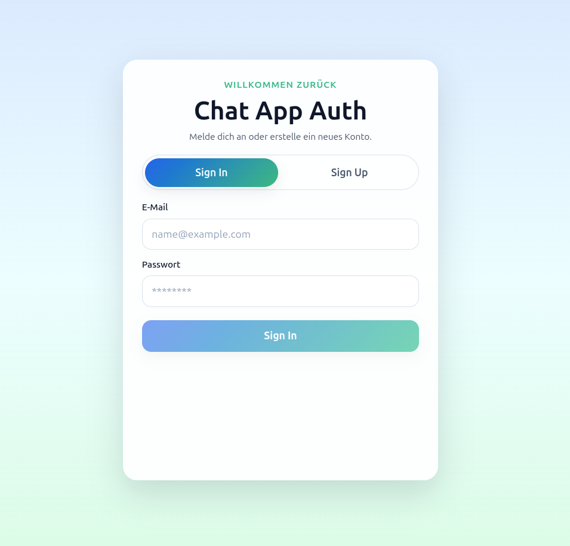
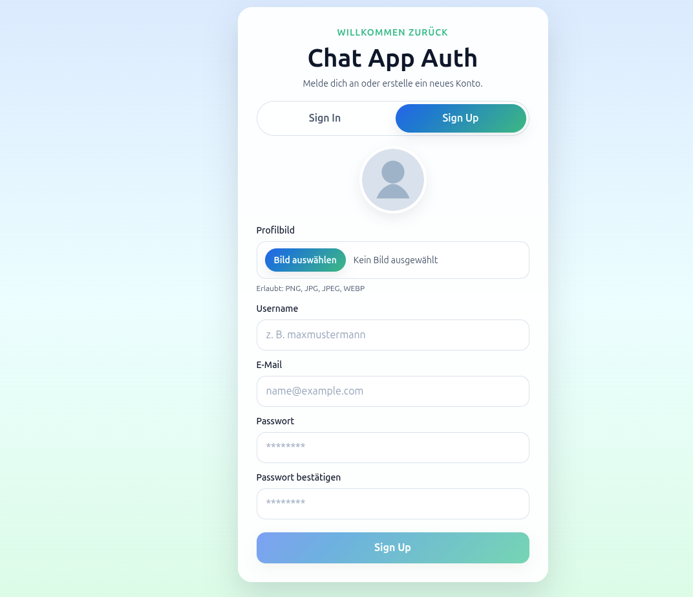
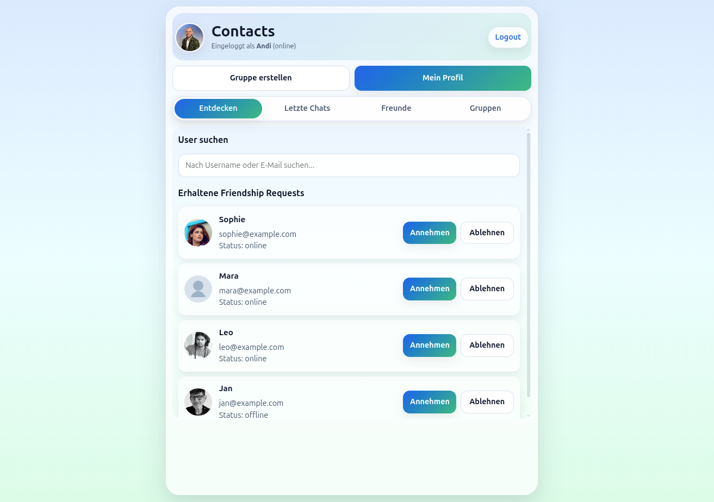
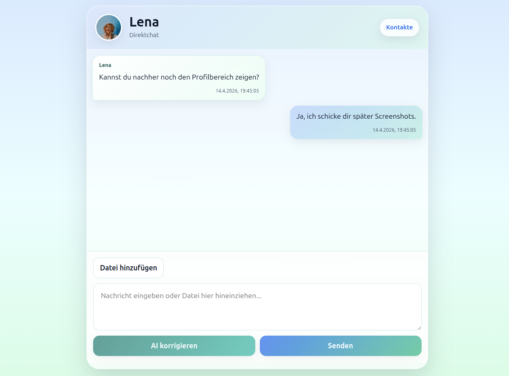
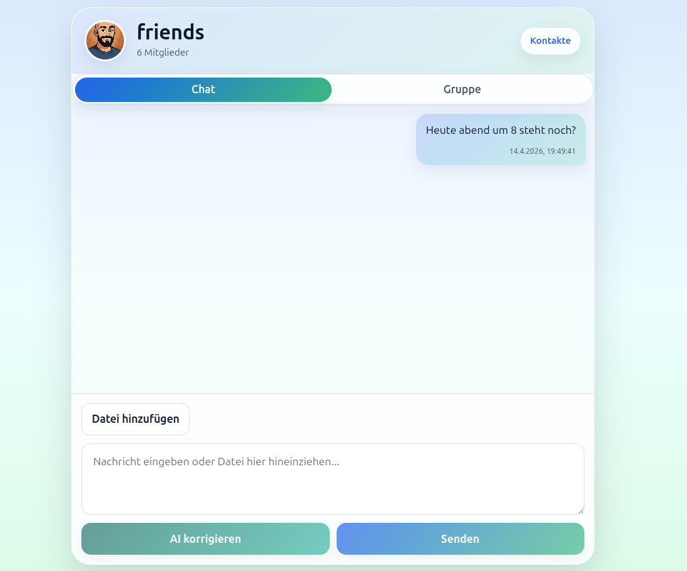
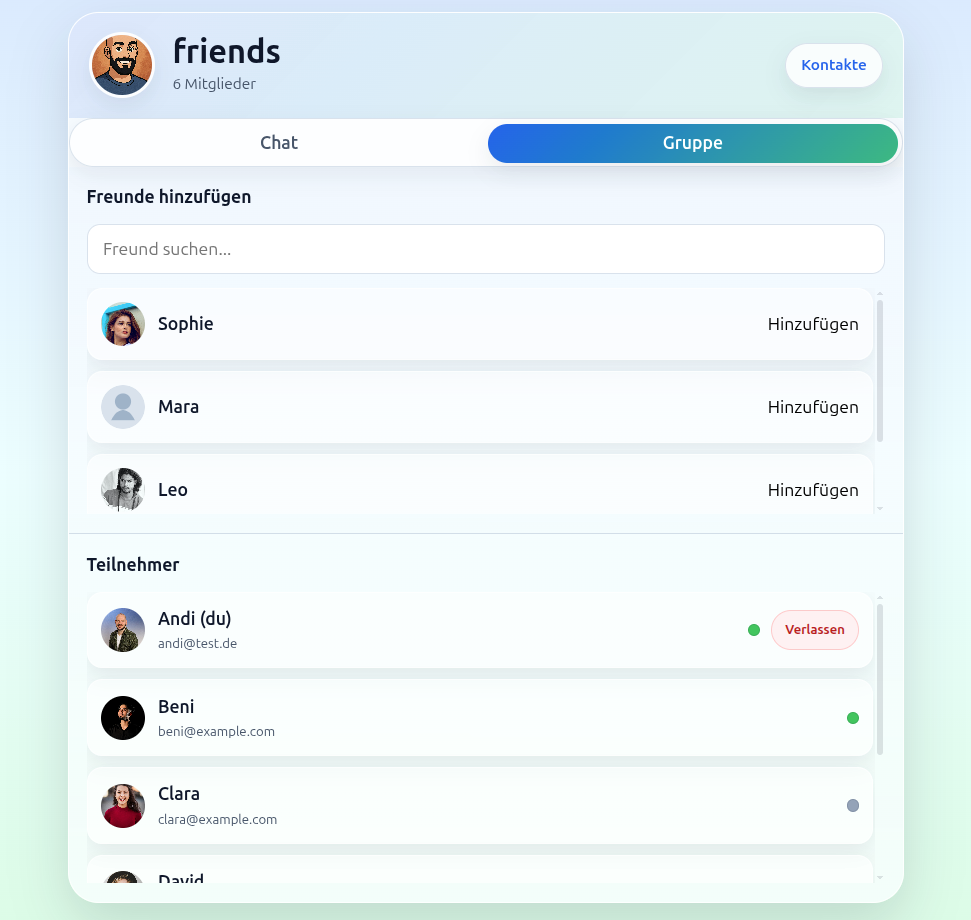
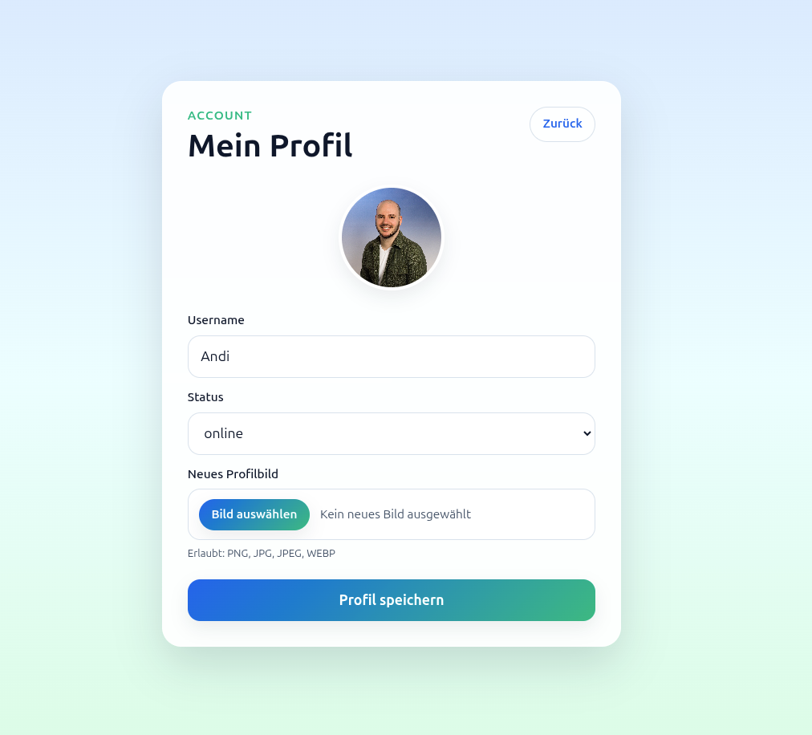

# Plauder

Plauder ist eine moderne Social-Media- und Chat-App im WhatsApp-ähnlichen Stil mit Fokus auf mobile Nutzung.  
Die Anwendung bietet Direktchats, Gruppenchats, Freundschaften, Datei-Uploads, KI-gestützte Textverbesserung und Moderation sowie Audio-/Video-Calls.

## Features

- Direktchats zwischen zwei Nutzern
- Gruppenchats mit Mitgliederverwaltung
- Freundschaftssystem mit Requests
- Nachrichten mit Anhängen
  - Bilder
  - Audio
  - Video
  - Dateien
- KI-Features
  - Rechtschreib- und Textkorrektur
  - Moderation von Nachrichten
- Audio-/Video-Calls
- Profilverwaltung mit Avatar
- Mobile-first UI im blau-grünen Gradient-Design

---

## Tech Stack

### Frontend
- React
- TypeScript
- Vite
- CSS Modules

### Backend
- Ruby on Rails
- Devise Authentication
- Active Storage
- Cloudinary
- OpenAI API

---

## Screenshots

<table>
  <tr>
    <td align="center">
      <a href="readme_files/screenshots/sign_in.png">
        
      </a>
      <br /><strong>Sign In</strong>
    </td>
    <td align="center">
      <a href="readme_files/screenshots/sign_up.png">
        
      </a>
      <br /><strong>Sign Up</strong>
    </td>
    <td align="center">
      <a href="readme_files/screenshots/contacts.png">
        
      </a>
      <br /><strong>Contacts</strong>
    </td>
  </tr>
  <tr>
    <td align="center">
      <a href="readme_files/screenshots/chat_direct.png">
        
      </a>
      <br /><strong>Direktchat</strong>
    </td>
    <td align="center">
      <a href="readme_files/screenshots/chat_group.png">
        
      </a>
      <br /><strong>Gruppenchat – Chat</strong>
    </td>
    <td align="center">
      <a href="readme_files/screenshots/chat_group2.png">
        
      </a>
      <br /><strong>Gruppenverwaltung</strong>
    </td>
  </tr>
  <tr>
    <td align="center">
      <a href="readme_files/screenshots/profile_editor.png">
        
      </a>
      <br /><strong>Profil bearbeiten</strong>
    </td>
    <td></td>
    <td></td>
  </tr>
</table>

---

## Voraussetzungen

Bevor du das Projekt startest, benötigst du:

- Node.js
- npm
- Ruby
- Bundler
- SQLite oder deine konfigurierte Rails-Datenbank
- Cloudinary-Zugang
- OpenAI API Key

---

## Wichtige Umgebungsvariablen

Im **`backend`**-Ordner musst du eine **`.env`**-Datei erstellen.

### `backend/.env`

```env
CLOUDINARY_URL=xxxxxxxxxxxxxxxxxxxxxxxxxxxxxxxxxxxxxxxxxxx
OPENAI_API_KEY=xxxxxxxxxxxxxxxxxxxxxxxxxxxxxxxxxxxxxxxxxxx

```
---

## Installation

### 1. Repository klonen

```bash
git clone <DEIN-REPO-URL>
cd <DEIN-PROJEKTORDNER>
```
### 2. Backend einrichten
```bash
cd backend
bundle install
bin/rails db:migrate
bin/rails db:seed
bin/rails server
```
Das Backend läuft danach standardmäßig auf:
http://localhost:3000

### 3. Frontend einrichten
```bash
cd frontend
npm install
npm run dev
```
Das Frontend läuft danach standardmäßig auf:
http://localhost:5173

## Nutzung

Nach dem Start stehen dir unter anderem folgende Funktionen zur Verfügung:

- Anmeldung mit dem Seed-User
- Durchsuchen von Kontakten
- Senden und Annehmen von Freundschaftsanfragen
- Öffnen von Direktchats
- Verwalten von Gruppenchats
- Senden von Nachrichten
- Hochladen von Anhängen
- Nutzung der KI-Korrektur für Nachrichten
- Aktualisieren von Profilbild und Status

## Architekturüberblick

Plauder ist in ein Frontend und ein API-Backend aufgeteilt:

- **Frontend:** React + TypeScript
- **Backend:** Rails API für Authentifizierung und Datenlogik
- **Storage:** Active Storage in Kombination mit Cloudinary
- **KI:** OpenAI zur Textverbesserung und Moderation

## Datenmodell / ERD

Das Datenmodell von Plauder deckt die folgenden Kernbereiche ab:

- Nutzer
- Freundschaften
- Chats und Gruppen
- Chat-Mitgliedschaften
- Nachrichten
- Nachrichten-Anhänge
- KI-Korrekturen
- KI-Moderation und Warnings
- Calls und Teilnehmer

## ERD

Das Entity-Relationship-Diagramm (ERD) zeigt die Beziehungen zwischen den zentralen Entitäten des Systems und bietet einen strukturellen Überblick über das Datenmodell.

```mermaid
erDiagram
  users {
    int id PK
    varchar username
    varchar email
    varchar password
    int status
    datetime created_at
    datetime updated_at
    int created_by FK
    int updated_by FK
  }

  friendships {
    int id PK
    int requester_id FK
    int receiver_id FK
    int friendship_status
    boolean active
    datetime created_at
    datetime updated_at
    int created_by FK
    int updated_by FK
  }

  chats {
    int id PK
    int chat_type
    varchar title
    datetime created_at
    datetime updated_at
    int created_by FK
    int updated_by FK
  }

  chat_memberships {
    int id PK
    int user_id FK
    int chat_id FK
    datetime created_at
    datetime updated_at
    int created_by FK
    int updated_by FK
  }

  messages {
    int id PK
    int sender_id FK
    int chat_id FK
    int message_type
    text content
    datetime created_at
    datetime updated_at
    int created_by FK
    int updated_by FK
  }

  message_warnings {
    int id PK
    int message_id FK
    text response_of_ai
    boolean dangerous_message
    int ai_type
    datetime created_at
    datetime updated_at
    int created_by FK
    int updated_by FK
  }

  message_ai_corrections {
    int id PK
    int message_id FK
    text message_corrected_by_ai
    int ai_type
    datetime created_at
    datetime updated_at
    int created_by FK
    int updated_by FK
  }

  message_attachments {
    int id PK
    int message_id FK
    varchar filename
    int file_type
    int duration_ms
    int byte_size
    int width
    int height
    datetime created_at
    datetime updated_at
    int created_by FK
    int updated_by FK
  }

  users ||--o{ friendships : requester_id
  users ||--o{ friendships : receiver_id
  users ||--o{ chat_memberships : user_id
  chats ||--o{ chat_memberships : chat_id
  chats ||--o{ messages : chat_id
  users ||--o{ messages : sender_id
  messages ||--o{ message_warnings : message_id
  messages ||--o{ message_ai_corrections : message_id
  messages ||--o{ message_attachments : message_id

## API-Bereiche

Unter `api/v1` stellt das Backend unter anderem Endpunkte für folgende Bereiche bereit:

- Authentifizierung (`Sign Up`, `Sign In`, `Sign Out`)
- Users
- Friendships
- Chats
- Chat Memberships
- Messages
- Message Attachments
- Message AI Corrections
- Message Warnings
- Calls
- Call Participants

```


## Projektstruktur

Das Projekt ist in zwei Hauptbereiche gegliedert:

- **`backend/`** – Rails API mit Authentifizierung, Datenmodell, Business-Logik, Active Storage und OpenAI-Services
- **`frontend/`** – React-Frontend mit TypeScript, Seiten, Komponenten, Auth-Kontext und API-Anbindung

```text
.
├── backend
│   ├── app
│   │   ├── channels
│   │   │   └── application_cable
│   │   │       ├── channel.rb
│   │   │       └── connection.rb
│   │   ├── controllers
│   │   │   ├── api
│   │   │   │   └── v1
│   │   │   │       ├── auth
│   │   │   │       │   ├── registrations_controller.rb
│   │   │   │       │   └── sessions_controller.rb
│   │   │   │       ├── base_controller.rb
│   │   │   │       ├── call_participants_controller.rb
│   │   │   │       ├── calls_controller.rb
│   │   │   │       ├── chat_memberships_controller.rb
│   │   │   │       ├── chats_controller.rb
│   │   │   │       ├── friendships_controller.rb
│   │   │   │       ├── home_controller.rb
│   │   │   │       ├── me_controller.rb
│   │   │   │       ├── message_ai_corrections_controller.rb
│   │   │   │       ├── message_attachments_controller.rb
│   │   │   │       ├── messages_controller.rb
│   │   │   │       ├── message_warnings_controller.rb
│   │   │   │       └── users_controller.rb
│   │   │   ├── application_controller.rb
│   │   │   ├── concerns
│   │   │   └── hello_controller.rb
│   │   ├── jobs
│   │   │   ├── application_job.rb
│   │   │   └── moderate_message_job.rb
│   │   ├── mailers
│   │   │   └── application_mailer.rb
│   │   ├── models
│   │   │   ├── application_record.rb
│   │   │   ├── call_participant.rb
│   │   │   ├── call.rb
│   │   │   ├── chat_membership.rb
│   │   │   ├── chat.rb
│   │   │   ├── concerns
│   │   │   ├── friendship.rb
│   │   │   ├── message_ai_correction.rb
│   │   │   ├── message_attachment.rb
│   │   │   ├── message.rb
│   │   │   ├── message_warning.rb
│   │   │   └── user.rb
│   │   ├── services
│   │   │   └── open_ai
│   │   │       ├── moderation_client.rb
│   │   │       └── text_improver_client.rb
│   │   └── views
│   │       └── layouts
│   │           ├── mailer.html.erb
│   │           └── mailer.text.erb
│   ├── bin
│   │   ├── bundle
│   │   ├── docker-entrypoint
│   │   ├── rails
│   │   ├── rake
│   │   └── setup
│   ├── config
│   │   ├── application.rb
│   │   ├── boot.rb
│   │   ├── cable.yml
│   │   ├── credentials.yml.enc
│   │   ├── database.yml
│   │   ├── environment.rb
│   │   ├── environments
│   │   │   ├── development.rb
│   │   │   ├── production.rb
│   │   │   └── test.rb
│   │   ├── initializers
│   │   │   ├── cors.rb
│   │   │   ├── devise.rb
│   │   │   ├── filter_parameter_logging.rb
│   │   │   ├── inflections.rb
│   │   │   ├── sessions_store.rb
│   │   │   └── zeitwerk.rb
│   │   ├── locales
│   │   │   ├── devise.en.yml
│   │   │   └── en.yml
│   │   ├── master.key
│   │   ├── puma.rb
│   │   ├── routes.rb
│   │   └── storage.yml
│   ├── config.ru
│   ├── db
│   │   ├── migrate
│   │   │   ├── 20260224180655_devise_create_users.rb
│   │   │   ├── 20260224181027_create_chats.rb
│   │   │   ├── 20260224181034_create_chat_memberships.rb
│   │   │   ├── 20260224181046_create_friendships.rb
│   │   │   ├── 20260224181056_create_messages.rb
│   │   │   ├── 20260224181107_create_message_attachments.rb
│   │   │   ├── 20260224181123_create_message_ai_corrections.rb
│   │   │   ├── 20260224181133_create_message_warnings.rb
│   │   │   ├── 20260224181138_create_calls.rb
│   │   │   ├── 20260224181146_create_call_participants.rb
│   │   │   ├── 20260305112242_create_active_storage_tables.active_storage.rb
│   │   │   └── 20260312182754_add_draft_to_messages.rb
│   │   ├── schema.rb
│   │   ├── seeds
│   │   │   └── avatars
│   │   │       ├── andi.jpg
│   │   │       ├── beni.jpg
│   │   │       ├── clara.jpg
│   │   │       ├── david.jpg
│   │   │       ├── default-avatar.png
│   │   │       ├── eva.jpg
│   │   │       ├── fiona.jpg
│   │   │       ├── gregor.jpg
│   │   │       ├── hannah.jpg
│   │   │       ├── jan.jpg
│   │   │       ├── lena.jpg
│   │   │       ├── leo.jpg
│   │   │       ├── mara.jpg
│   │   │       ├── nils.jpg
│   │   │       ├── sophie.jpg
│   │   │       └── tom.jpg
│   │   └── seeds.rb
│   ├── Dockerfile
│   ├── Gemfile
│   ├── Gemfile.lock
│   ├── lib
│   │   └── tasks
│   ├── log
│   │   └── development.log
│   ├── public
│   │   └── robots.txt
│   ├── Rakefile
│   ├── README.md
│   ├── storage
│   │   └── cc
│   │       └── ve
│   ├── test
│   │   ├── channels
│   │   │   └── application_cable
│   │   │       └── connection_test.rb
│   │   ├── controllers
│   │   │   ├── api
│   │   │   │   └── v1
│   │   │   │       ├── auth
│   │   │   │       │   ├── registrations_controller_test.rb
│   │   │   │       │   └── sessions_controller_test.rb
│   │   │   │       ├── base_controller_test.rb
│   │   │   │       ├── call_participants_controller_test.rb
│   │   │   │       ├── calls_controller_test.rb
│   │   │   │       ├── chat_memberships_controller_test.rb
│   │   │   │       ├── chats_controller_test.rb
│   │   │   │       ├── friendships_controller_test.rb
│   │   │   │       ├── home_controller_test.rb
│   │   │   │       ├── me_controller_test.rb
│   │   │   │       ├── message_ai_corrections_controller_test.rb
│   │   │   │       ├── message_attachments_controller_test.rb
│   │   │   │       ├── messages_controller_test.rb
│   │   │   │       ├── message_warnings_controller_test.rb
│   │   │   │       └── users_controller_test.rb
│   │   │   └── hello_controller_test.rb
│   │   ├── fixtures
│   │   │   ├── call_participants.yml
│   │   │   ├── calls.yml
│   │   │   ├── chat_memberships.yml
│   │   │   ├── chats.yml
│   │   │   ├── files
│   │   │   ├── friendships.yml
│   │   │   ├── message_ai_corrections.yml
│   │   │   ├── message_attachments.yml
│   │   │   ├── messages.yml
│   │   │   ├── message_warnings.yml
│   │   │   └── users.yml
│   │   ├── integration
│   │   ├── mailers
│   │   ├── models
│   │   │   ├── call_participant_test.rb
│   │   │   ├── call_test.rb
│   │   │   ├── chat_membership_test.rb
│   │   │   ├── chat_test.rb
│   │   │   ├── friendship_test.rb
│   │   │   ├── message_ai_correction_test.rb
│   │   │   ├── message_attachment_test.rb
│   │   │   ├── message_test.rb
│   │   │   ├── message_warning_test.rb
│   │   │   └── user_test.rb
│   │   └── test_helper.rb
│   └── vendor
├── frontend
│   ├── eslint.config.js
│   ├── index.html
│   ├── package.json
│   ├── package-lock.json
│   ├── public
│   │   └── vite.svg
│   ├── README.md
│   ├── src
│   │   ├── App.css
│   │   ├── App.tsx
│   │   ├── assets
│   │   │   ├── default-avatar.png
│   │   │   └── react.svg
│   │   ├── components
│   │   │   ├── contacts
│   │   │   │   ├── ContactsHeader.module.css
│   │   │   │   ├── ContactsHeader.tsx
│   │   │   │   ├── FriendsSection.module.css
│   │   │   │   ├── FriendsSection.tsx
│   │   │   │   ├── ReceivedRequestsSection.module.css
│   │   │   │   ├── ReceivedRequestsSection.tsx
│   │   │   │   ├── RecentChatsSection.module.css
│   │   │   │   ├── RecentChatsSection.tsx
│   │   │   │   ├── UserSearchSection.module.css
│   │   │   │   └── UserSearchSection.tsx
│   │   │   ├── RequireAuth.tsx
│   │   │   └── UserAvatar.tsx
│   │   ├── context
│   │   │   └── AuthContext.tsx
│   │   ├── hooks
│   │   │   └── useAuth.ts
│   │   ├── index.css
│   │   ├── main.tsx
│   │   ├── pages
│   │   │   ├── chat-detail
│   │   │   │   ├── components
│   │   │   │   │   ├── ChatDetailActions.tsx
│   │   │   │   │   ├── ChatHeader.tsx
│   │   │   │   │   ├── ImageModal.tsx
│   │   │   │   │   ├── MessageComposer.tsx
│   │   │   │   │   ├── MessageList.tsx
│   │   │   │   │   └── ParticipantsCard.tsx
│   │   │   │   ├── hooks
│   │   │   │   │   └── useChatDetail.ts
│   │   │   │   ├── types.ts
│   │   │   │   └── utils.ts
│   │   │   ├── ChatDetail.module.css
│   │   │   ├── ChatDetail.tsx
│   │   │   ├── Contacts.module.css
│   │   │   ├── Contacts.tsx
│   │   │   ├── HomeAuth.module.css
│   │   │   ├── HomeAuth.tsx
│   │   │   ├── ProfilePage.module.css
│   │   │   └── ProfilePage.tsx
│   │   ├── services
│   │   │   ├── api.ts
│   │   │   └── authApi.ts
│   │   ├── styles
│   │   │   ├── base.css
│   │   │   ├── buttons.css
│   │   │   ├── forms.css
│   │   │   └── tokens.css
│   ├── tsconfig.app.json
│   ├── tsconfig.json
│   ├── tsconfig.node.json
│   └── vite.config.ts
└── README.md

```
